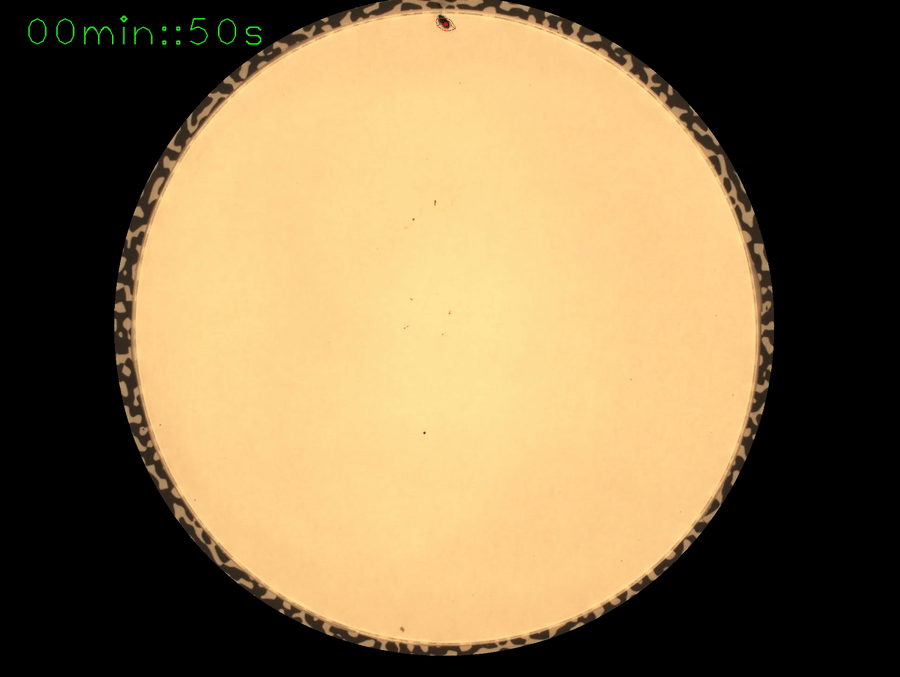
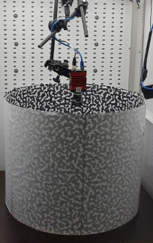

# realbugtracker


(See gif shows an example of a moving Nebria brevicollis ( aka bug:) the red border shows the detected contour and the bigger red dot, the centroid of the moving contour)

## project aim

* extract movement trajectory of moving objects in videos from image based tracking
* process a small example (download linked attached) of a moving bug (species: Nebria brevicollis)

## supported os

* tested on linux debian / ubuntu builds

## license

MIT License

## dependency

* c++ library OpenCV (4.6 or above)
* c++ library bgs lib (3.2 or above)
* c libarchive (3.4 or above)

## needed input

* picture collection (frames) of a moving object (download example)
* time code of each frame in a text file (see example)
* neutral background
* fix orientation of camera to 2D arena surface

### preparation of the setup

1. install camera in top view position ( orthogonal and centered) of flat 2D surface e.g.

(the pictures shows a Prosilica GT 1920 camera from Allied Vision, which could be controlled via a c++ sdk vimba, not published here)

1. do a camera calibration, explained [here](https://docs.opencv.org/4.x/d4/d94/tutorial_camera_calibration.html) (use the code at the opencv repository [here](https://github.com/opencv/opencv/tree/4.x/samples/cpp/tutorial_code/calib3d/camera_calibration/camera_calibration.cpp) )
2. save the camera calibration file

# processing

3 software pieces are implemented for processing
 
# Tool 1: extractcenterpoints.cpp
aim: extract the moving objects, write polygons and center to one file for each frame, see the [code](src/extractcenterpoints.cpp) and read the steps


step 0) do lens correction, uses the camera calibration to make lens correction

step 1) cut the region of interest, to avoid any reflection artifacts

step 2) uses [bgslibrary](https://github.com/andrewssobral/bgslibrary) to extract the moving object, here we use method "Background Segmentation with Feedback: "The Pixel-Based Adaptive Segmenter" was used  TODO cite paper here

step 3) apply  edge detection

step 4) apply filter for contours sizes

step 5) calc hu moments and and mass center for the contour selection (optional, needed for visual debugging needed)

step 6) calc convex hull of all polygons

step 7) calc hu moments and and mass center (centroid) for the convex hull 
step 8) write all contours, mass centers and the convex hull points to a yml file

# Tool 2:  mergetimeline.cpp
aim: merge the polygon file and the timetable to on time line file of centroids, see the [code](src/mergetimeline.cpp)


step 0) read all files

step 1) select the centroid of the convex hull, if there is at least one polygon in the frame

step 2) write down the information to 1 file

# Tool 3:  producetrajectory.cpp
aim: merge the polygon file and the timetable to on trajectory file
see the [code](src/producetrajectory.cpp)


step 0) project trajectory position data from camera space into real world space using the camera calibration file

step 1) summaries all position in a trajectory file

# 
## howto run the code

```bash
cmake .
make -j 10 
cd bin
```


## build bgslib on linux debian

```bash
git clone https://github.com/andrewssobral/bgslibrary 
cd bgslibrary
git checkout v3.2.0
cmake .
make -j 10
sudo make install
```